# LAB 8 - Analyse de posture et exposition d'applications mobiles avec BeVigil et Yaazhini

## 1. Présentation du lab

Ce lab a pour objectif de réaliser une analyse défensive de la posture de sécurité d'une application mobile Android à l'aide de deux outils :

* **BeVigil** : plateforme d'analyse permettant d'identifier les signaux d'exposition d'une application mobile, comme les secrets potentiels, les permissions, les URLs, les assets, les composants exposés et les vulnérabilités.
* **Yaazhini APK Scanner** : outil d'analyse statique permettant d'examiner un APK Android afin d'identifier les permissions, activités, receivers, URLs, vulnérabilités et bibliothèques.

L'application analysée est **InjuredAndroid**, une application Android volontairement vulnérable utilisée dans un cadre pédagogique pour l'apprentissage de la sécurité mobile.

L'objectif principal est de collecter les résultats, les organiser, les trier, identifier les faux positifs, corréler les constats avec OWASP MASVS et produire un rapport exploitable.

---

## 2. Cadre légal et périmètre

L'analyse a été réalisée dans un cadre strictement légal, pédagogique et défensif.

### Cible analysée

| Élément         | Valeur                                    |
| --------------- | ----------------------------------------- |
| Application     | InjuredAndroid                            |
| Fichier APK     | InjuredAndroid.apk                        |
| Package Android | b3nac.injuredandroid                      |
| Version         | 1.0.9                                     |
| Type d'artefact | APK pédagogique volontairement vulnérable |
| Cadre           | LAB 8 - Sécurité des applications mobiles |

### Limites définies

Les actions suivantes n'ont pas été réalisées :

* exploitation active des vulnérabilités ;
* attaque contre une cible réelle ;
* test intrusif ;
* contournement de mécanismes de sécurité ;
* utilisation abusive des clés, endpoints ou domaines détectés ;
* publication de secrets ou de données sensibles en clair.

Toute donnée sensible détectée doit être masquée dans les livrables.


## 3. Organisation du workspace

Le travail a été organisé dans une arborescence structurée afin de séparer le périmètre, les résultats BeVigil, les résultats Yaazhini, le triage et les preuves.

Structure globale du projet :

```text
lab8/
├── 00-scope/
│   ├── InjuredAndroid.apk
│   └── scope.md
├── 01-bevigil/
│   ├── bevigil_assets.csv
│   ├── bevigil_note.md
│   └── bevigil_vuln.csv
├── 02-yaazhini/
│   └── yaazhini_notes.md
├── 03-triage/
│   ├── owasp_mapping.md
│   └── triage.csv
├── docs/
│   └── images/
├── checklist_fin.md
└── README.md
```


## 4. Préparation de l'APK

L'APK pédagogique **InjuredAndroid.apk** a été placé dans le dossier `00-scope/`.

Un hash SHA-256 a été calculé afin de garantir l'intégrité et la traçabilité de l'artefact analysé.

Commande utilisée :

```powershell
Get-FileHash -Path "00-scope\InjuredAndroid.apk" -Algorithm SHA256
```

Cette étape permet de s'assurer que l'APK analysé est bien le même durant toute la réalisation du lab.

Capture du hash :

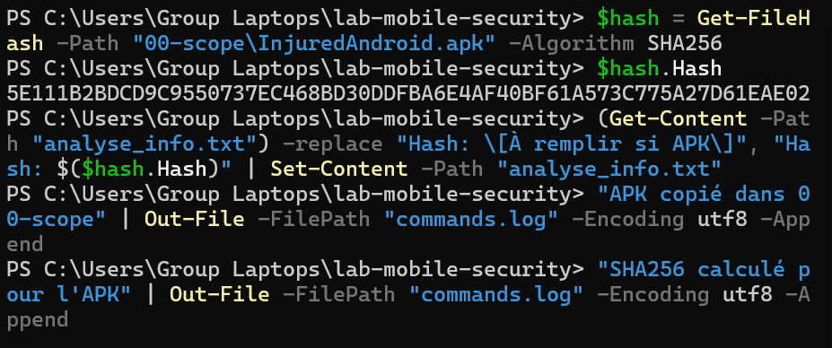

---

## 5. Analyse avec BeVigil

## 5.1 Upload de l'APK

L'application **InjuredAndroid.apk** a été soumise à BeVigil afin de lancer l'analyse automatique.

Capture de l'upload réussi :

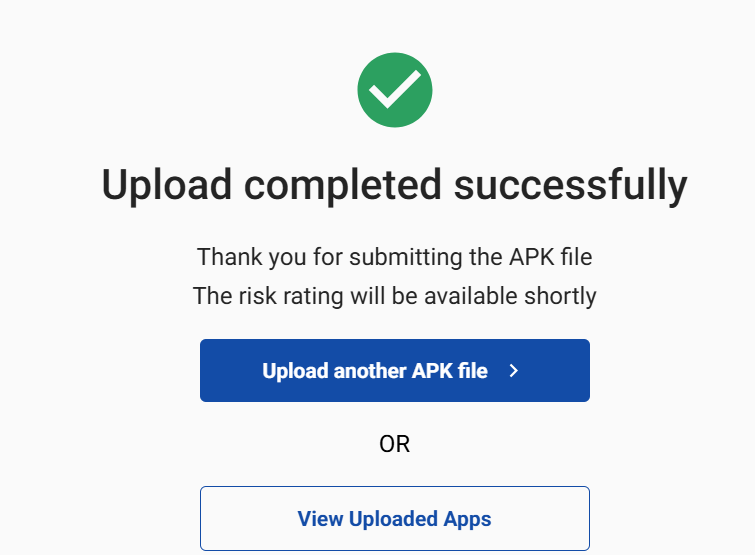

Après l'upload, BeVigil a affiché le suivi de traitement de l'application.

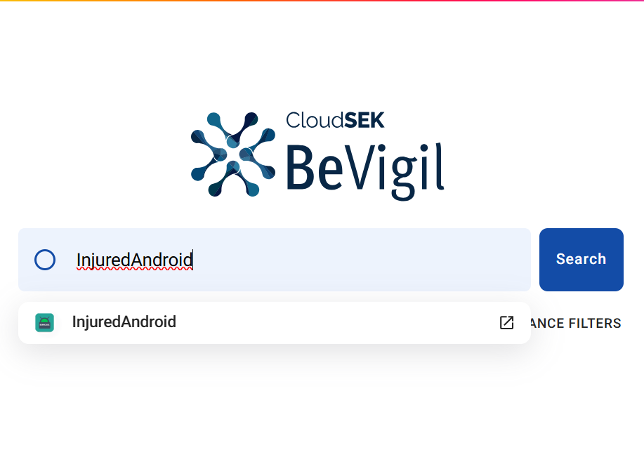

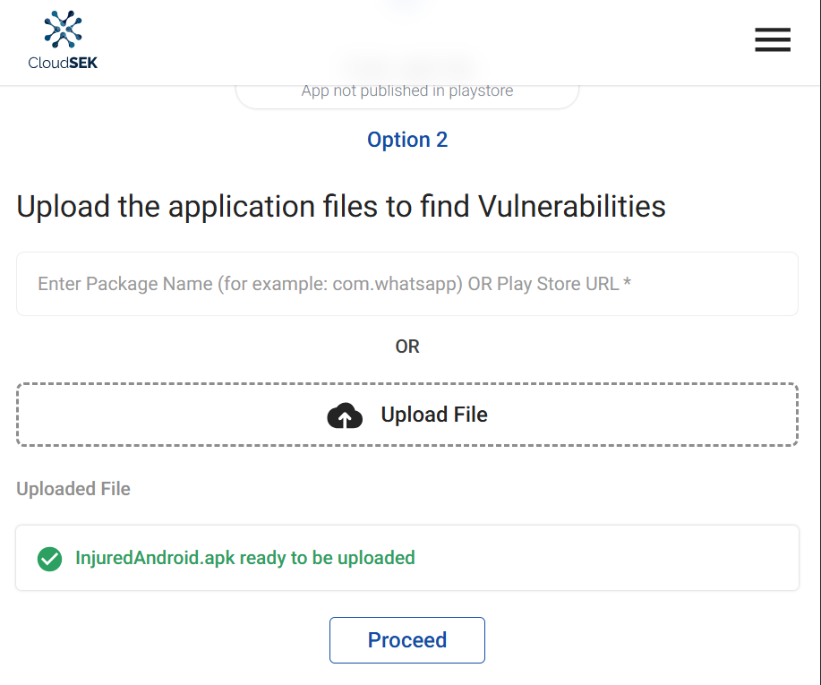

---

## 5.2 Rapport BeVigil prêt

BeVigil a ensuite terminé l'analyse et a indiqué que le rapport de sécurité était disponible.

Statuts observés :

* `INITIATED - App scan started`
* `PROCESSING - Meta-data extraction complete`
* `ANALYSING - App analysis complete`
* `DONE - Security report is ready`

Capture du rapport prêt :

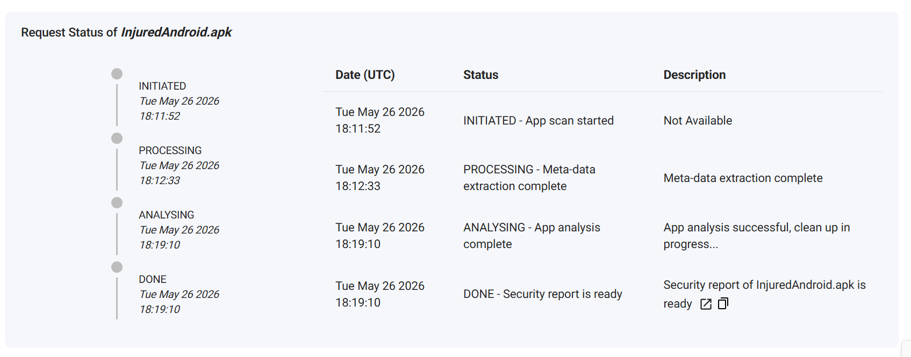

---

## 5.3 Résumé global BeVigil

Le rapport BeVigil présente les informations suivantes :

| Élément               | Résultat             |
| --------------------- | -------------------- |
| Application           | InjuredAndroid       |
| Package               | b3nac.injuredandroid |
| Version               | 1.0.9                |
| Security Rating       | 6.9                  |
| Niveau                | Average              |
| Total detected issues | 7                    |
| High issues           | 1                    |
| Medium issues         | 2                    |
| Low issues            | 4                    |

Capture de la vue générale :

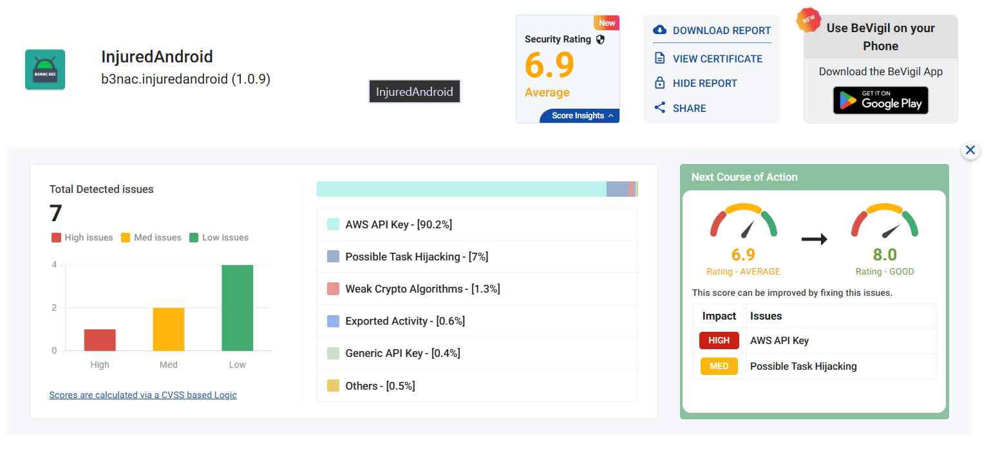

---

## 5.4 Issues détectées par BeVigil

BeVigil a identifié plusieurs problèmes et signaux d'exposition :

* AWS API Key potentielle ;
* Possible Task Hijacking ;
* Weak Crypto Algorithms ;
* Exported Activity ;
* Generic API Key ;
* Assets réseau exposés ;
* Permissions risquées.

Capture du résumé des issues :

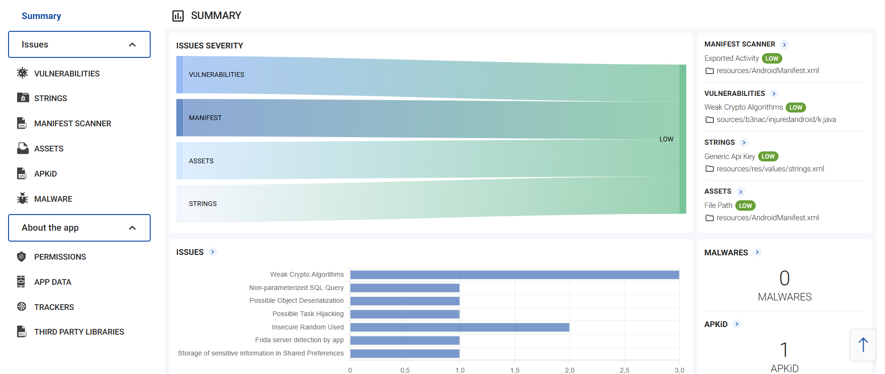

---

## 5.5 Permissions et assets BeVigil

Le rapport indique la répartition suivante des permissions :

| Type de permission | Nombre |
| ------------------ | -----: |
| Safe               |      2 |
| Risky              |      3 |
| Dangerous          |      0 |

Les assets et domaines visibles dans le rapport incluent notamment :

* `us.google.com`
* `m.do.co`
* `injuredandroid.firebaseio.com`

Capture des permissions et assets :

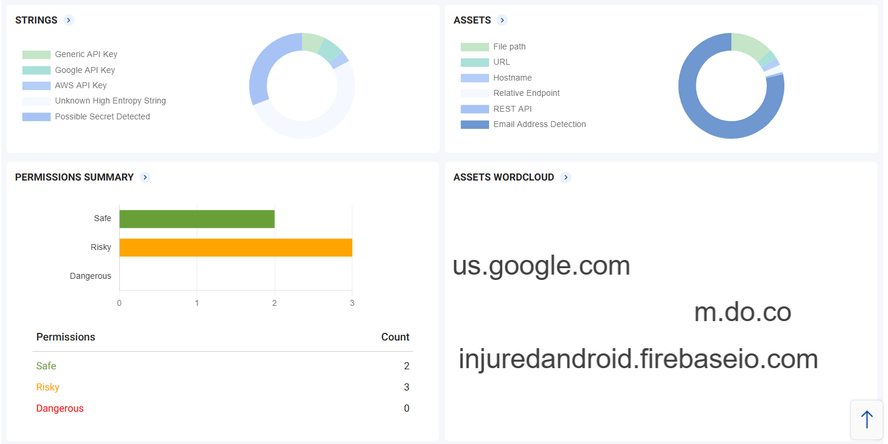

Capture complémentaire :

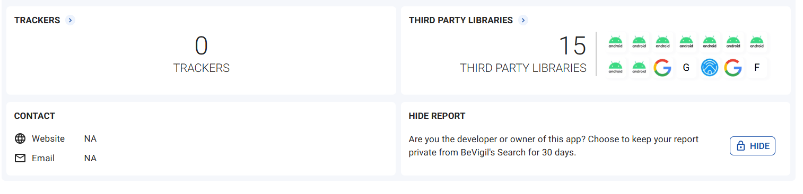

---

## 5.6 Manifest Scanner

Dans la section **Manifest Scanner**, BeVigil signale une activité exportée.

| Élément          | Valeur              |
| ---------------- | ------------------- |
| Rule             | Exported Activity   |
| Severity         | Low                 |
| CWE              | CWE-926             |
| Fichier concerné | AndroidManifest.xml |

Une activité exportée peut être accessible par d'autres applications. Cela peut augmenter la surface d'attaque si l'activité n'est pas correctement protégée.

Capture du Manifest Scanner :

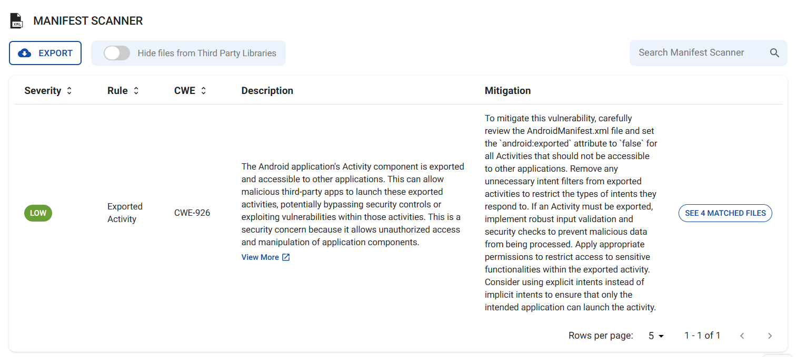

---

## 5.7 Exports BeVigil

Deux fichiers CSV ont été conservés dans le dossier `01-bevigil/` :

```text
01-bevigil/bevigil_assets.csv
01-bevigil/bevigil_vuln.csv
```

Ces fichiers contiennent les résultats exportés depuis BeVigil concernant les assets et les vulnérabilités détectées.

---

## 5.8 Conclusion BeVigil

L'analyse BeVigil a permis d'identifier plusieurs signaux importants :

* possible exposition d'une clé AWS API ;
* possible clé API générique ;
* activité exportée ;
* algorithmes cryptographiques faibles ;
* permissions risquées ;
* assets réseau visibles ;
* aucun malware détecté.

Ces résultats sont considérés comme des signaux d'exposition. Ils doivent être vérifiés et contextualisés avant d'être considérés comme des vulnérabilités confirmées.

---

## 6. Analyse avec Yaazhini APK Scanner

## 6.1 Résumé de l'application

L'APK a ensuite été analysé avec **Yaazhini APK Scanner**. L'outil a extrait les informations générales de l'application.

| Élément                    | Valeur               |
| -------------------------- | -------------------- |
| App Name                   | lab8                 |
| Android Package            | b3nac.injuredandroid |
| Date of Scan               | 28-MAY-2026, 2:04 PM |
| App Version                | 1.0.9                |
| Android Min SDK Version    | 21                   |
| Android Target SDK Version | 29                   |
| App Size                   | 17.5 MB              |

Capture du résumé Yaazhini :

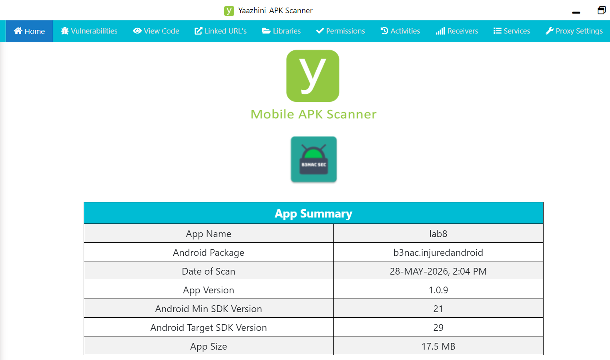

---

## 6.2 Vulnérabilités détectées

Yaazhini a identifié plusieurs vulnérabilités classées par niveau de sévérité.

### High - Insecure communication

| Élément         | Valeur                 |
| --------------- | ---------------------- |
| Vulnérabilité   | Insecure communication |
| Fichier associé | a2.java                |
| Niveau          | High                   |

Cette vulnérabilité indique la présence d'une communication non sécurisée. Si elle est utilisée dans un contexte réel, elle peut exposer les données en transit.

Capture :

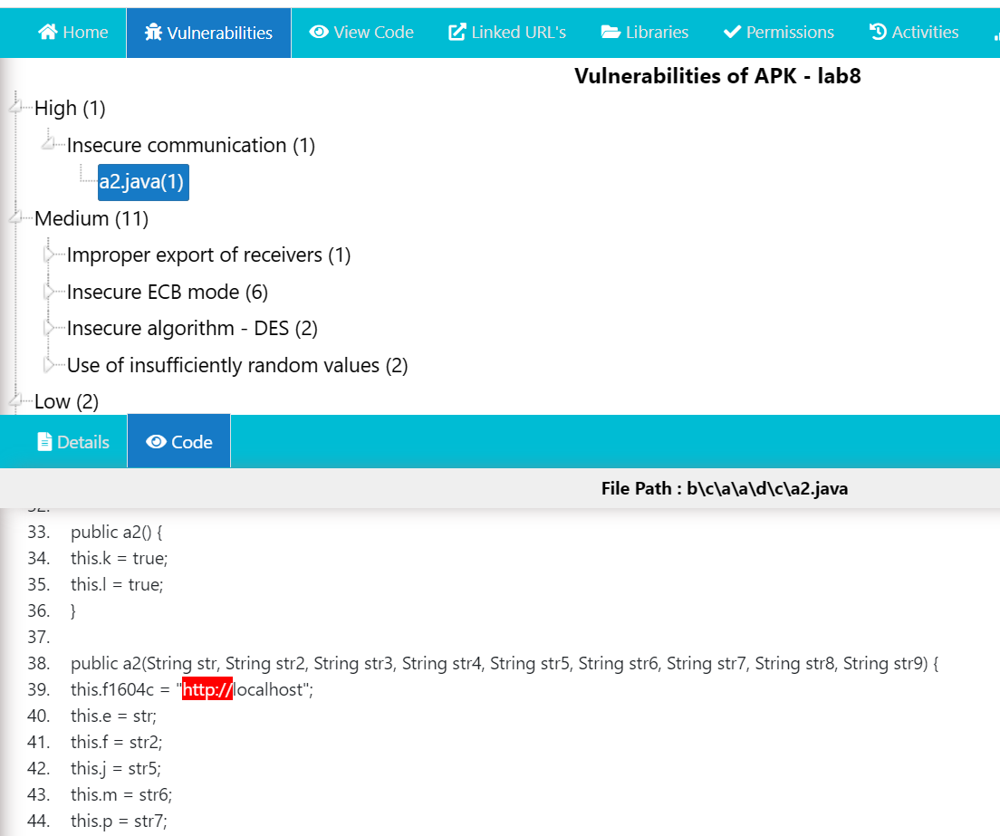

### Medium - Improper export of receivers

| Élément          | Valeur                       |
| ---------------- | ---------------------------- |
| Vulnérabilité    | Improper export of receivers |
| Élément concerné | FlagFiveReceiver             |
| Fichier          | AndroidManifest.xml          |
| Niveau           | Medium                       |

Un receiver exporté peut être invoqué par une autre application si aucune permission ne le protège.

Capture :

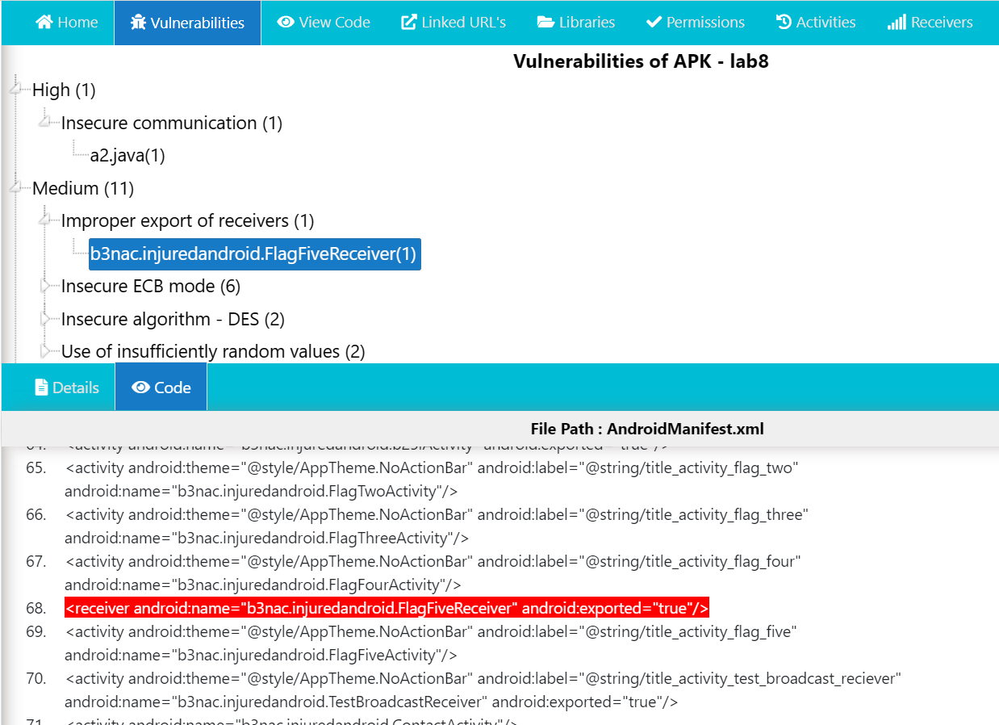

### Medium - Cryptographie faible

Yaazhini signale également :

* Insecure ECB mode ;
* Insecure algorithm DES ;
* Use of insufficiently random values.

Ces constats indiquent des faiblesses liées à l'utilisation de mécanismes cryptographiques ou pseudo-aléatoires non adaptés aux usages sensibles.

Capture :

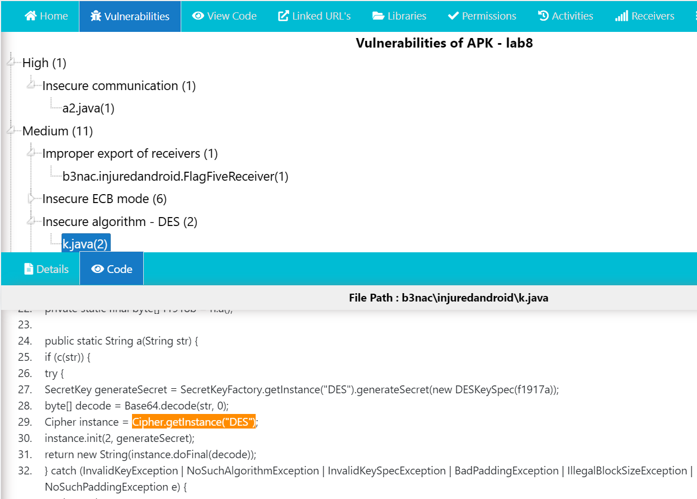

---

## 6.3 Permissions Android

Yaazhini a détecté les permissions suivantes :

| Permission                                  | Description                                                 |
| ------------------------------------------- | ----------------------------------------------------------- |
| `android.permission.ACCESS_NETWORK_STATE`   | Permet de connaître l'état des connexions réseau            |
| `android.permission.INTERNET`               | Permet à l'application d'accéder à Internet                 |
| `android.permission.WRITE_EXTERNAL_STORAGE` | Permet d'écrire sur le stockage externe                     |
| `android.permission.READ_PHONE_STATE`       | Permet de lire des informations liées à l'état du téléphone |
| `android.permission.READ_EXTERNAL_STORAGE`  | Permet de lire le contenu du stockage externe               |

Analyse :

Les permissions `INTERNET` et `ACCESS_NETWORK_STATE` sont fréquentes dans les applications connectées. Cependant, les permissions liées au stockage externe et à l'état du téléphone doivent être justifiées car elles augmentent la surface d'exposition.

Capture des permissions :

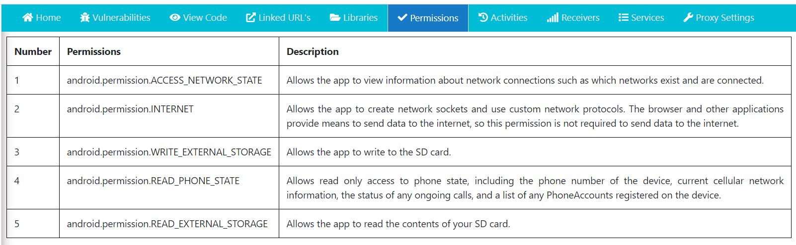

---

## 6.4 Activities

Yaazhini a listé plusieurs activités Android appartenant à l'application InjuredAndroid.

Exemples d'activités détectées :

* `b3nac.injuredandroid.FlagSeventeenActivity`
* `b3nac.injuredandroid.CSPBypassActivity`
* `b3nac.injuredandroid.AssemblyActivity`
* `b3nac.injuredandroid.RCEActivity`
* `b3nac.injuredandroid.SettingsActivity`
* `b3nac.injuredandroid.DeepLinkActivity`
* `b3nac.injuredandroid.FlagOneLoginActivity`
* `b3nac.injuredandroid.FlagNineFirebaseActivity`

Analyse :

La présence de nombreuses activités est normale pour une application pédagogique composée de plusieurs challenges. Cependant, les activités sensibles doivent être vérifiées afin d'éviter une exposition inutile.

Capture des activités :

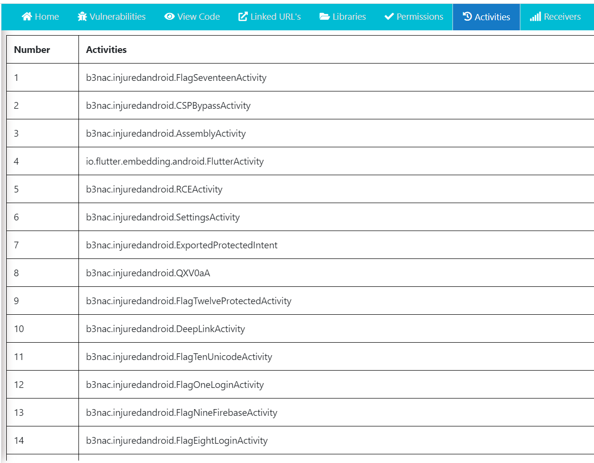

---

## 6.5 Receivers

Yaazhini a détecté un receiver exporté :

| Receiver                                | Exported |
| --------------------------------------- | -------- |
| `b3nac.injuredandroid.FlagFiveReceiver` | true     |

Analyse :

Un receiver exporté peut être appelé par une autre application. Cela confirme un risque d'exposition de composant Android si aucune permission de protection n'est appliquée.

Recommandation :

* définir `android:exported="false"` si le receiver ne doit pas être accessible ;
* ajouter une permission si le receiver doit rester accessible ;
* vérifier les intents reçus par ce composant.

Capture des receivers :

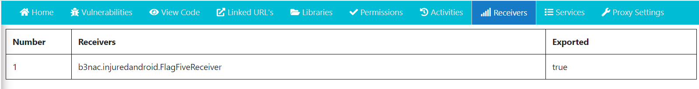

---

## 6.6 Linked URLs

Yaazhini a identifié plusieurs URLs et domaines liés à l'application.

Exemples visibles :

* `https://injuredandroid.firebaseio.com`
* `https://m.do.co/c/9348bb7410b4`
* `https://plus.google.com/`
* `https://cloud.google.com`
* `https://console.firebase.google.com`
* `https://firebase.google.com`
* `https://github.com`

Analyse :

Ces URLs montrent que l'application référence plusieurs services externes, notamment Firebase, Google, GitHub et DigitalOcean. Ces informations permettent de cartographier une partie des services et dépendances utilisés par l'application.

Capture des URLs :

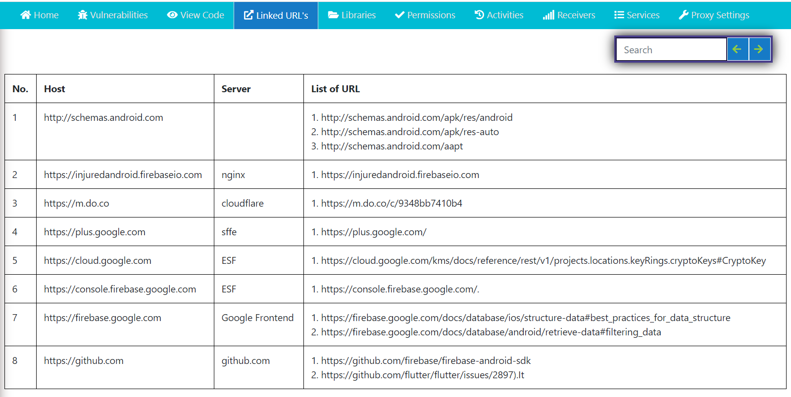

---

## 7. Triage des constats

Les résultats de BeVigil et Yaazhini ont été regroupés dans le fichier :

```text
03-triage/triage.csv
```

Ce fichier contient les colonnes suivantes :

```text
ID, Source, Élément, Preuve, Confiance, Sévérité, Impact, Recommandation, Référence OWASP, Statut
```

### Extrait du triage

| ID       | Source              | Élément                      | Sévérité | Statut      |
| -------- | ------------------- | ---------------------------- | -------- | ----------- |
| FIND-001 | BeVigil             | AWS API Key potentielle      | High     | À confirmer |
| FIND-002 | BeVigil             | Exported Activity            | Low      | Confirmé    |
| FIND-009 | Yaazhini            | Insecure communication       | High     | Confirmé    |
| FIND-010 | Yaazhini            | Improper export of receiver  | Medium   | Confirmé    |
| FIND-012 | Yaazhini            | Insecure algorithm DES       | Medium   | Confirmé    |
| FIND-018 | BeVigil et Yaazhini | Weak crypto confirmé         | Medium   | Confirmé    |
| FIND-019 | BeVigil et Yaazhini | Composants exposés confirmés | Medium   | Confirmé    |

Le triage permet de consolider les résultats des deux outils et d'éviter les doublons.

---

## 8. Corrélation OWASP MASVS

Les constats ont été associés aux catégories OWASP MASVS suivantes :

| Constat                             | Catégorie OWASP | Justification                                                            |
| ----------------------------------- | --------------- | ------------------------------------------------------------------------ |
| AWS API Key potentielle             | MASVS-STORAGE   | Les secrets ne doivent pas être stockés dans l'application cliente       |
| Generic API Key potentielle         | MASVS-STORAGE   | Les clés API doivent être protégées                                      |
| Exported Activity                   | MASVS-PLATFORM  | Les composants Android exposés doivent être contrôlés                    |
| Improper export of receiver         | MASVS-PLATFORM  | Les receivers exportés peuvent être invoqués par d'autres applications   |
| Insecure communication              | MASVS-NETWORK   | Les communications doivent être protégées par HTTPS/TLS                  |
| Assets réseau exposés               | MASVS-NETWORK   | Les domaines et endpoints doivent être identifiés et sécurisés           |
| Weak Crypto Algorithms              | MASVS-CRYPTO    | Les algorithmes faibles doivent être remplacés                           |
| Insecure ECB mode                   | MASVS-CRYPTO    | Le mode ECB ne doit pas être utilisé pour protéger des données sensibles |
| Insecure algorithm DES              | MASVS-CRYPTO    | DES est un algorithme obsolète                                           |
| Use of insufficiently random values | MASVS-CRYPTO    | Les valeurs sensibles doivent utiliser un générateur sûr                 |
| Vulnérabilités liées au code        | MASVS-CODE      | Le code doit suivre les bonnes pratiques de développement sécurisé       |

Le mapping complet est disponible dans :

```text
03-triage/owasp_mapping.md
```

---

## 9. Faux positifs et limites

Certains résultats doivent être interprétés avec prudence :

* Une permission déclarée n'est pas automatiquement une vulnérabilité.
* Une URL visible n'est pas forcément sensible.
* Une chaîne détectée comme clé API doit être vérifiée manuellement.
* Les constats provenant de bibliothèques tierces doivent être distingués du code applicatif principal.
* L'application InjuredAndroid est volontairement vulnérable, donc certains résultats sont attendus dans ce contexte pédagogique.

---

## 10. Recommandations défensives

### Priorité haute

* Utiliser HTTPS/TLS pour toutes les communications réseau.
* Ne jamais stocker de clés API ou secrets dans le code client.
* Masquer toute clé détectée dans les rapports.
* Révoquer les clés exposées si elles sont réelles et actives.

### Priorité moyenne

* Remplacer DES par AES avec une configuration sécurisée.
* Éviter le mode ECB.
* Utiliser `SecureRandom` pour les usages de sécurité.
* Vérifier les receivers et activities exportés.
* Protéger les composants sensibles par des permissions.

### Priorité basse

* Réduire les permissions Android au strict nécessaire.
* Documenter les domaines et services externes.
* Vérifier les URLs détectées.
* Nettoyer les chaînes inutiles ou sensibles dans l'application.

---

## 11. Livrables produits

Les livrables produits sont :

```text
00-scope/scope.md
01-bevigil/bevigil_note.md
01-bevigil/bevigil_assets.csv
01-bevigil/bevigil_vuln.csv
02-yaazhini/yaazhini_notes.md
03-triage/triage.csv
03-triage/owasp_mapping.md
checklist_fin.md
README.md
docs/images/
```

---

## 12. Conclusion

Ce lab a permis de réaliser une analyse de posture mobile sur l'application InjuredAndroid à l'aide de BeVigil et Yaazhini.

BeVigil a permis d'identifier des signaux d'exposition tels que des clés potentielles, des permissions risquées, des assets réseau, des vulnérabilités et des composants exportés.

Yaazhini a complété l'analyse par une inspection statique de l'APK, en mettant en évidence une communication non sécurisée, des algorithmes cryptographiques faibles, un receiver exporté, des permissions sensibles et plusieurs URLs liées à l'application.

Les constats ont ensuite été triés, consolidés et corrélés avec OWASP MASVS afin de produire une documentation exploitable dans un cadre défensif.

Aucune exploitation active n'a été réalisée. Le travail respecte le périmètre légal et pédagogique défini au début du lab.
